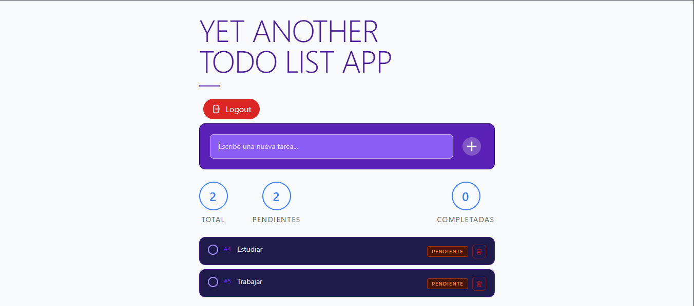

# Task Manager

Interfaz web para consumir la Task Manager API. Construida con HTML, Tailwind CSS v3 y JavaScript modular (ES Modules).

## Página Deployed

- https://taskmanagerapifront.netlify.app/

## Screenshots



## Tecnologías

- HTML5
- Tailwind CSS v3 (compilado con CLI)
- JavaScript ES Modules (sin bundler)

## Requisitos

- Node.js 18+
- Tailwind CSS CLI instalado

## Desarrollo

Compila Tailwind en modo watch:

```bash
npx tailwindcss -i ./input.css -o ./output.css --watch
```

Abre `index.html` con Live Server (VSCode) o cualquier servidor local. No abrir con `file://` directamente porque los ES Modules requieren HTTP.

## Producción

Compila Tailwind minificado antes de subir:

```bash
npx tailwindcss -i ./input.css -o ./output.css --minify
```

## Configuración de la API

En `js/api.js`, actualiza `API_URL` con la URL de tu backend:

```js
// Local
const API_URL = 'http://localhost:3000/tasks';

// Producción
const API_URL = 'https://tu-api.up.railway.app/tasks';
```

## Funcionalidades

- Cargar tareas al iniciar (GET)
- Agregar nueva tarea con botón o tecla Enter (POST)
- Marcar tarea como completada/pendiente (PATCH)
- Eliminar tarea (DELETE)
- Contador de tareas totales, pendientes y completadas
- Mensaje de estado vacío cuando no hay tareas
- Notificaciones toast para cada acción
- Textos largos con scroll sin romper el layout
- Sin `innerHTML` con datos del usuario (protección XSS)

## Deploy en Netlify

1. Compila Tailwind con `--minify`
2. Sube la carpeta `task-manager-frontend/` a Netlify via drag & drop o conectando el repo de GitHub
3. Publish directory: `src`
4. Build command: dejar vacío

> Asegúrate de que el backend esté desplegado y que `API_URL` en `api.js` apunte a la URL pública antes de subir.
